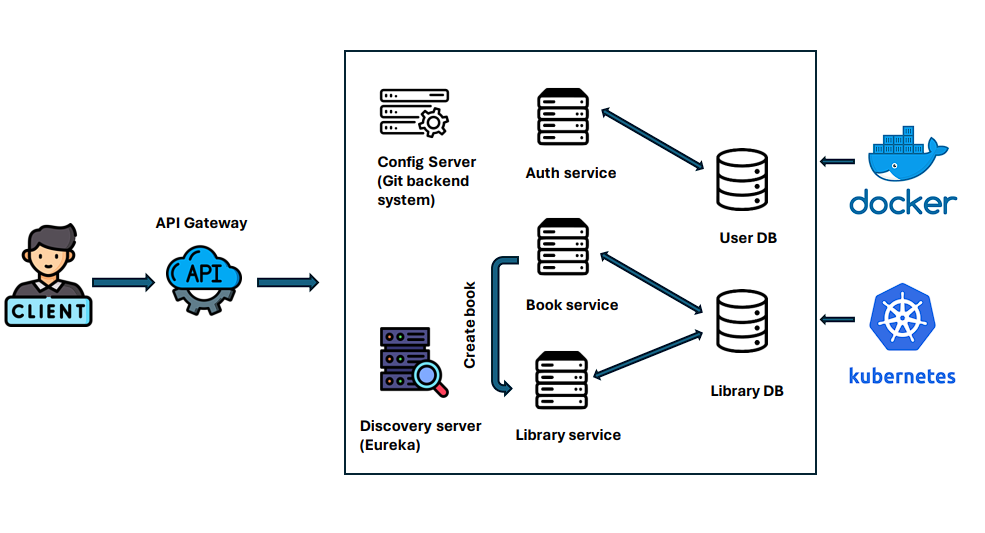

# Test task - Library API

Before starting the test, I gave it an estimate of 20 hours to complete, so I had to stick to that time.

* Basic Web API functionality - 4 hours
* Additional Web API Functionality - 6 hours
* Application Configuration: Docker, Kubernetes - 4 hours
* Testing of basic functionality - 1 hour
* Basic documentation + SwaggerOpenAPI - 3 hours
* Writing logic to protect the application - 2 hours

Best practices that were not addressed in this project due to tight deadlines:

* No database migration, instead autogeneration of JPA tables.

* Weak application testing, both unit and integration tests should be written for services and controllers. In addition, the task decription did not describe test coverage. And you should store your application secrets in vault storage for example

* Service level logging, logs should be in distributed format, e.g. Spring Cloud Sleuth could be used.

* Not very strong application security, in a real project I would use off-the-shelf solutions like Keycloak.

<a href="README.md#run">Going to how to run the section</a>

## Application flow diagram



6 services whose name are shown below have been devised within the scope of this project.

- Authentication Service
- Book Service
- Library Service
- Config Server
- Gateway API
- Dicovery(Registry) Server

### Git Backend for Config server

<a href="https://github.com/Nikita-ctr/springappconfig">Link</a>


### Used Dependencies
* Core
    * Spring
        * Spring Boot
        * Spring Boot Test
        * Spring Security
        * Spring Web
            * RestTemplate
        * Spring Data
            * Spring Data JPA
        * Spring Cloud
            * Spring Cloud Gateway Server
            * Spring Cloud Config Server
            * Spring Cloud Config Client
    * Netflix
        * Eureka Server
        * Eureka Client
* Database
    * Mysql
* Zipkin
* Docker
* Kubernetes
* Log4j2


### Explore Rest APIs 

#### You can test a ready-made collection of endpoints in the postman_collection folder

<table style="width:100%">
  <tr>
      <th>Method</th>
      <th>Url</th>
      <th>Description</th>
      <th>Valid Request Body</th>
  </tr>
    <tr>
      <td>GET</td>
      <td>/books</td>
      <td>Get all books</td>
      <td></td>
  </tr>
    <tr>
      <td>GET</td>
      <td>/books/{book_id}</td>
      <td>Get book by id</td>
      <td></td>
  </tr>
    <tr>
      <td>GET</td>
      <td>/library/loans/available</td>
      <td>Get all available books</td>
      <td></td>
  </tr>
      <tr>
      <td>GET</td>
      <td>/library/loans/borrowed</td>
      <td>Get all borrowed books</td>
      <td></td>
  </tr>
    <tr>
      <td>GET</td>
      <td>/books/isbn/{book_isbn}</td>
      <td>Get book by isbn</td>
      <td></td>
  </tr>
  <tr>
      <td>POST</td>
      <td>authenticate/signup</td>
      <td>Signup for User</td>
      <td><a href="README.md#signup">Info</a></td>
  </tr>
  <tr>
      <td>POST</td>
      <td>authenticate/login</td>
      <td>Login for User</td>
      <td><a href="README.md#login">Info</a></td>
  </tr>
  <tr>
      <td>POST</td>
      <td>/books</td>
      <td>Add new book</td>
      <td><a href="README.md#createbook">Info</a></td>
  </tr>
  <tr>
      <td>PUT</td>
      <td>/books/{book_isbn}</td>
      <td>Update book by book_isbn</td>
      <td><a href="README.md#updatebook">Info</a></td>
  </tr>
  <tr>
      <td>DELETE</td>
      <td>/books/{book_isbn}</td>
      <td>Delete book by isbn</td>
      <td></td>
  </tr>

</table>

## Valid Request Body (All requests must contain the Bearer token except signup and login)

##### <a id="signup"> Signup for User
```
    http://localhost:9090/authenticate/signup
    
     {
        "username" : "User",
        "password" : "User123",
        "email" : "user.test@gmail.com"
     }
    
```

##### <a id="login"> Login for User
```
    http://localhost:9090/authenticate/login
    
    {
        "username" : "User",
        "password" : "User"
    }
```

##### <a id="createbook"> Add new book 
```
    http://localhost:9090/books
    
  {
        "isbn" : "41334sdf123",
        "title" : "BLOOD MONEY",
        "genre" : "thriller",
        "description" : "The author of "Red-Handed" depicts",
        "author" : "Peter Schweizer"
  }


When you create a book, a request is sent to another service that automatically borrows that book for 4 hour

```

##### <a id="updatebook"> Update book info
```
    http://localhost:9090/books/{book_isbn}
    
  {
        "isbn" : "41334sdf123",
        "title" : "BLOOD MONEY",
        "genre" : "thriller",
        "description" : "The author of "Red-Handed" depicts",
        "author" : "Peter Schweizer"
  }
```


### 🔨 <a id="run"> Run the App

<b>Local</b>

<b>1 )</b> Download your project from this link `https://github.com/Nikita-ctr/Library-API.git`

<b>2 )</b> Go to the project's home directory :  `cd library-api-gateway`

<b>3 )</b> Run <b>Service Registry (Eureka Server)</b>

<b>4 )</b> Run <b>config server</b>

<b>5 )</b> Run <b>zipkin</b> through these command shown below on <b>Docker</b>
```
    docker run -d -p 9411:9411 openzipkin/zipkin
```

<b>6 )</b> Run <b>Gateway service</b>

<b>7 )</b> Run other services (<b>authentication-service</b>, <b>library-service</b>, <b>book-service</b>)

Before running, you can add test data for clarity to the bookdb database, which is located in book-service/src/main/resources/db/migration

<b>Docker build</b>

<b>2 )</b> Build <b>jar</b> file for all services shown below

<table style="width:100%">
  <tr>
    <th>Service</th>
    <th>Command</th>
  </tr>
  <tr>
    <td>service-registry</td>
    <td>mvn clean install</td>
  </tr>
  <tr>
    <td>configserver</td>
    <td>mvn clean install</td>
  </tr>
  <tr>
    <td>apigateway</td>
    <td>mvn clean install -DskipTests</td>
  </tr>
  <tr>
    <td>auth-service</td>
    <td>mvn clean install -DskipTests</td>
  </tr>
  <tr>
    <td>libraryservice</td>
    <td>mvn clean install -DskipTests</td>
  </tr>
  <tr>
    <td>bookservice</td>
    <td>mvn clean install -DskipTests</td>
  </tr>
</table>

<b>3 )</b> Build all <b>images</b> and push to <b>Docker Hub</b>
```
    1 ) service-registry
     
        - docker build -t library/serviceregistry:0.0.1 .
        - docker tag library/serviceregistry:0.0.1 pomer2002/serviceregistry
        - docker push pomer2002/serviceregistry
        
    2 ) configserver
     
        - docker build -t library/configserver:0.0.1 .
        - docker tag library/configserver:0.0.1 pomer2002/configserver
        - docker push pomer2002/configserver
    
    3 ) api-gateway
     
        - docker build -t library/apigateway:0.0.1 .
        - docker tag library/apigateway:0.0.1 pomer2002/apigateway
        - docker push pomer2002/apigateway
    
    4 ) auth-service
     
        - docker build -t library/authservice:0.0.1 .
        - docker tag library/authservice:0.0.1 pomer2002/authservice
        - docker push pomer2002/authservice
        
    5 ) book-service
     
        - docker build -t library/bookservice:0.0.1 .
        - docker tag library/bookservice:0.0.1 pomer2002/bookservice
        - docker push pomer2002/bookservice
        
    6 ) library-service
     
        - docker build -t library/libraryservice:0.0.1 .
        - docker tag library/libraryservice:0.0.1 pomer2002/libraryservice
        - docker push pomer2002/libraryservice
        
```

<b>4 )</b> Run all <b>Containers</b> through this command shown below under main folder
```
    docker-compose up -d
```

<b>Kubernetes</b>

<b>2 )</b> Open <b>command prompt</b> and install <b>kubectl</b> through this command shown below 
```
    minikube kubectl --
```

<b>3 )</b> Start <b>minikube</b> through this command shown below.
```
    minikube start
```

<b>4 )</b> Open <b>minikube dashboard</b> through this command shown below.
```
    minikube dashboard
```

<b>5 )</b> Run all <b>images</b> coming from Docker hub on Kubernetes through this command shown below.
```
    kubectl apply -f k8s
```

<b>6 )</b> Show all information about images running on <b>Kubernetes</b> through this command
```
    kubectl get all
```

<b>7 )</b> Show all <b>services</b> running on Kubernetes through this command
```
    kubectl get services
```

<b>8 )</b> Show <b>eureka server</b> on Kubernetes through this command
```
    minikube service eureka-lb
```

<b>9 )</b> Show <b>api gateway</b> on Kubernetes through this command
```
    minikube service cloud-gateway-svc
```
<b>10 )</b> Copy <b>IP address</b> and Replace <b>it</b> with <b>localhost</b> of the <b>endpoints</b>

### The default setting here is to autogenerate tables at application startup
if you want to create tables manually (which is more correct), manually create 2 databases:

userdb and execute the script for it:
```
CREATE TABLE roles (
    id   INT AUTO_INCREMENT PRIMARY KEY,
    name VARCHAR(20) NULL
);

CREATE TABLE users (
    id       INT AUTO_INCREMENT PRIMARY KEY,
    email    VARCHAR(255) NOT NULL,
    password VARCHAR(255) NULL,
    username VARCHAR(255) NOT NULL,
    CONSTRAINT UK_users_email UNIQUE (email),
    CONSTRAINT UK_users_username UNIQUE (username)
);

CREATE TABLE user_roles (
    user_id INT NOT NULL,
    role_id INT NOT NULL,
    PRIMARY KEY (user_id, role_id),
    CONSTRAINT FK_user_roles_roles FOREIGN KEY (role_id) REFERENCES roles (id),
    CONSTRAINT FK_user_roles_users FOREIGN KEY (user_id) REFERENCES users (id)
);
```

And second one, bookdb:
```
CREATE TABLE book (
    id          BIGINT AUTO_INCREMENT PRIMARY KEY,
    author      VARCHAR(255) NOT NULL,
    description VARCHAR(255) NOT NULL,
    genre       VARCHAR(255) NOT NULL,
    isbn        VARCHAR(255) NOT NULL,
    title       VARCHAR(255) NOT NULL
);

CREATE TABLE book_loans (
    id          BIGINT AUTO_INCREMENT PRIMARY KEY,
    loan_time   DATETIME(6) NOT NULL,
    return_time DATETIME(6) NOT NULL,
    book_id     BIGINT NOT NULL,
    CONSTRAINT FK_book_loans_book FOREIGN KEY (book_id) REFERENCES book (id)
);
```
